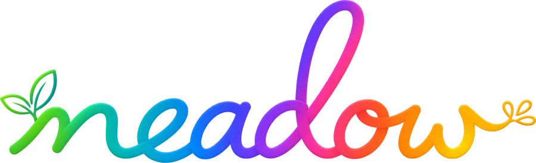
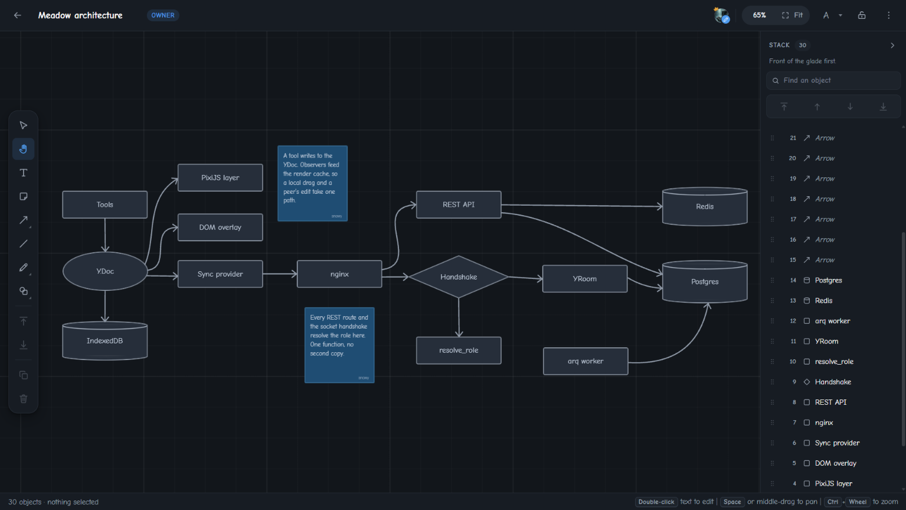
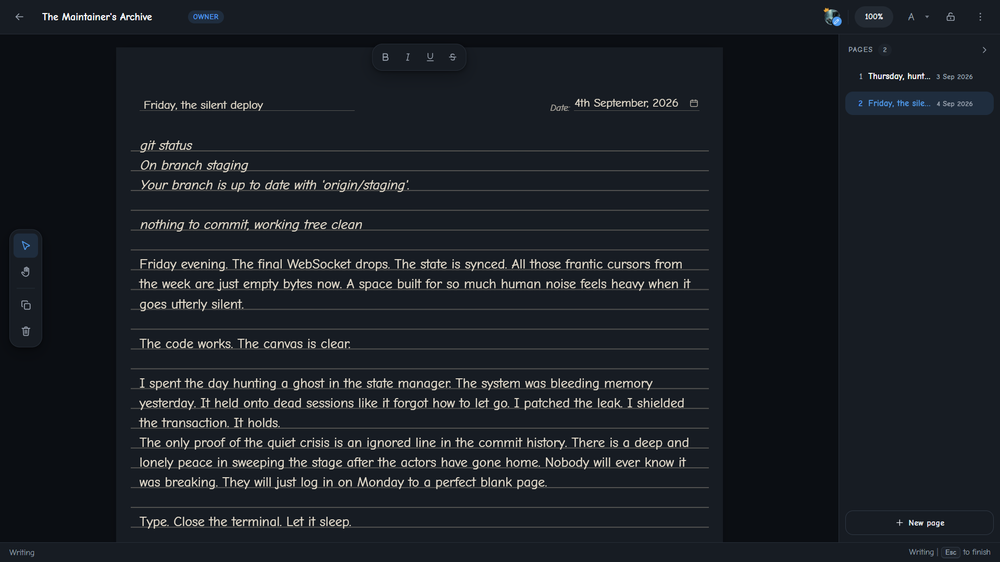
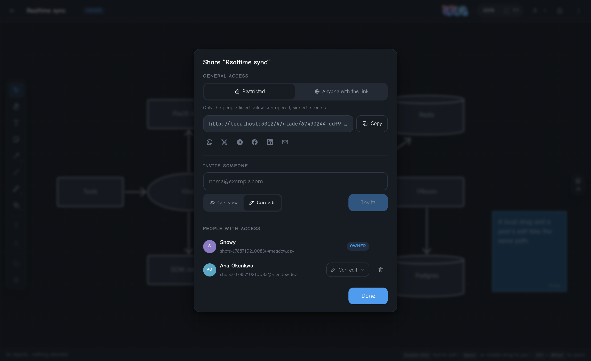
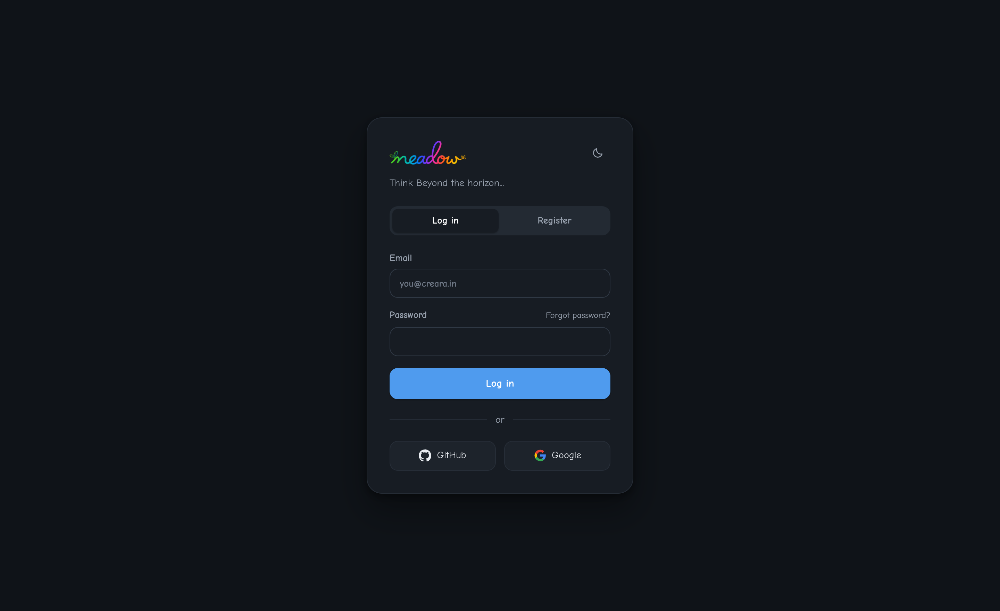
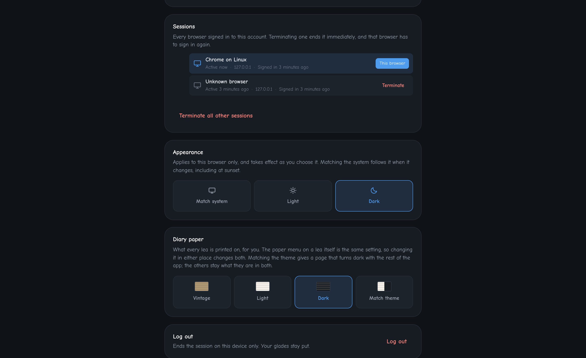
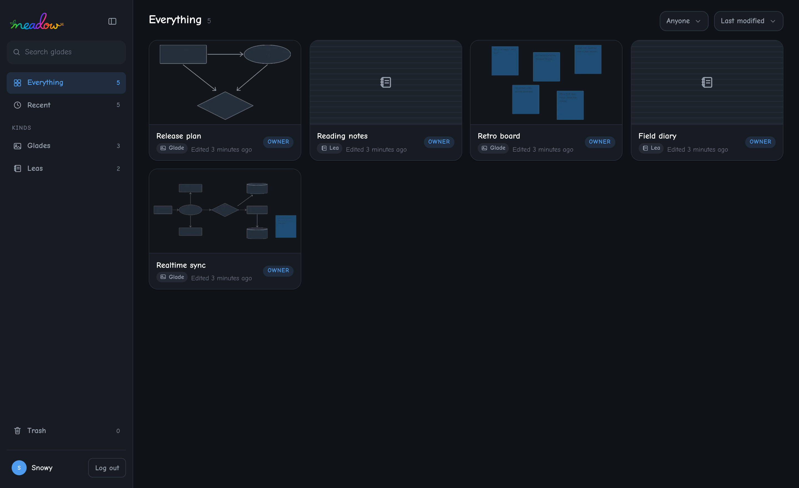

<div align="center">



### Think beyond the horizon

One endless surface for writing, drawing and thinking, shared live.

**[meadow.creara.in](https://meadow.creara.in)**

</div>

<br>

<p align="center">
  
</p>

<br>

## What it is

Meadow gives you a surface with no edges and no page. A paragraph, a rectangle, an
arrow, a sticky note and a pen stroke are the same kind of thing here: an object at a
position, which you can move, label, connect, restack and share without switching modes
or opening a second app. Diagrams and prose sit next to each other because there is
nowhere else for them to go.

Everything is live. Open a board with somebody and you see their cursor, their selection
and their edits as they happen. Close the laptop, keep working, and the two versions
merge when you come back rather than asking which one to keep.

A board is a **glade**. Somebody else's cursor crossing it is a **wanderer**.

---

## On the canvas

**Draw.** Eight primitive shapes - rectangle, ellipse, diamond, parallelogram, triangle,
trapezoid, polygon with a settable side count, and cylinder - each on its own key. Every
one of them carries text, so a box with a label is a box, not a box plus a text object
sitting on top of it and drifting away from it.

**Connect.** Arrows come straight, curved or elbowed, and their ends bind to shapes
rather than to coordinates: move the shape and the arrow follows, resolved against the
real outline instead of the bounding box. A selected arrow gets handles you can steer,
and a double-click puts a label on it, because half of what an arrow means is written on
it.

**Write.** Text objects are proper rich text - bold, italic, underline, strikethrough,
eight sizes - edited in place at any zoom. Two people typing in one paragraph merge
character by character.

**Ink.** Five nibs (ballpoint, fineliner, calligraphy, brush, highlighter) in four widths
and seven colours, with a stylus's pressure honoured and a mouse's speed standing in for
it, so a mouse-drawn line still reads as handwriting. Ask the pen to tidy up and it
replaces a drawn box with a real one, keeping your ink's colour and weight; ask it to
snap to shapes and you get an object indistinguishable from one drawn from the rail.

**Type in your own script.** Phonetic input for thirteen languages of India - Bengali,
Hindi, Assamese, Gujarati, Kannada, Malayalam, Marathi, Nepali, Odia, Punjabi, Sanskrit,
Tamil and Telugu. Type `amar`, get `আমার`. No keyboard layout to install.

**Restack.** Depth is a list, and the stack panel shows it: every object front first,
ringed on the canvas as you point at each row, dragged into place or given a depth to
sit at.

---

## Leas: a diary, on the same canvas

<br>

<p align="center">
  
</p>

<br>

A **lea** is a kind of glade that is printed rather than blank: twenty-five ruled lines,
a subject and a date across the top, and pages you can add, name, reorder and tear out.
You click a rule and write on it, and move between lines with the arrow keys. Four stocks
to print it on, from aged kraft to the dark one above.

It is not a second editor. The same document, the same tools and the same objects, on a
different surface - which is the whole point of having kinds at all.

---

## Sharing and access

<br>

<p align="center">
  
</p>

<br>

A glade is restricted until you say otherwise. Turn on the link and anyone holding it can
open the board, signed in or not, as a viewer or an editor. Invite by address and the
invitation works whether or not that address has an account yet. Somebody who finds a
restricted board can ask to view or ask to edit, and you decide - a request is a record,
never a key.

Roles resolve live from the database on every request and every socket connect, so
removing somebody closes their board rather than waiting for a token to expire. There is
also a lock, for the times the risk is your own hands: flip it and the board stops
accepting edits from this browser, which is a guard while presenting, not a permission.

---

## Your account, and where it is open

<br>

<p align="center">
  
</p>

<br>

Sign in with an email and password, with GitHub, or with Google - all three land on one
account, keyed by the verified address. New addresses are confirmed before the account
opens, and forgotten passwords are recoverable.

<br>

<p align="center">
  
</p>

<br>

The profile page lists every browser currently holding a session: what it is, from what
address, when it signed in and when it was last active. Terminate one and that browser is
locked out immediately rather than at the end of its token's life, and it is told why
while it sits idle. The list updates itself as sessions come and go. A session that is
yours stays yours: closing a tab mid-refresh or losing the connection does not sign you
out.

---

## Your boards

<br>

<p align="center">
  
</p>

<br>

Boards are cards with live previews, filtered by kind, by who owns them and by search.
Deleting is not the one irreversible click: a deleted board goes to a trash it can be
restored from for thirty days, keeping its update history, its share link and its member
list intact while it waits.

---

## How it works

Two layers share one camera. Shapes, arrows and ink are drawn on a WebGL layer through a
single instanced draw call, whatever the object count; rich text is a DOM overlay sitting
exactly on top of it, because rich text cannot be edited inside WebGL. The two must not
drift by so much as a pixel at any zoom, and that is checked by sampling screenshots
rather than by comparing the two transforms in code.

The document is a CRDT. Tools never touch React state: a tool writes to the document, the
document's observers update the render cache, and the frame is drawn from that - so a
local drag and a peer's edit take the same path through the same code. Edits made offline
are held in the browser and merge on reconnect.

Meadow installs as an app. On a phone, "Add to Home Screen", or the install button in a
desktop browser's address bar, gives it its own window and icon. A service worker keeps
the app's code on the device, so the installed app opens without a network. Signing in
and loading boards from the server still need one.

The websocket handshake is the security boundary. The token is validated and the board
role resolved before the connection joins a room, by one function that every REST route
calls as well.

<div align="center">

| | |
|---|---|
| **Canvas** | React 19, TypeScript, Vite, PixiJS 8, TipTap, rbush, Zustand, Tailwind |
| **Realtime** | yjs over websocket, offline persistence in the browser, awareness for presence |
| **PWA** | Web app manifest, a build-generated service worker that precaches the app shell |
| **Server** | FastAPI, pycrdt, SQLAlchemy 2 async, Alembic, arq |
| **Data** | PostgreSQL 16, Redis 7 |
| **Auth** | argon2id, JWT access tokens, rotating refresh tokens with reuse detection and recovery of rotations the browser never received |
| **Infra** | Docker Compose, nginx, GitHub Actions to GHCR to a VPS |

</div>

Full design, schema and reasoning: [`docs/core/ARCHITECTURE.md`](docs/core/ARCHITECTURE.md).
The decisions that were expensive to reverse, what has been measured, and the known sharp
edges: [`docs/DECISIONS.md`](docs/DECISIONS.md).

---

## Running it

Requires Docker. No host Python and no host Node.

```bash
cp .env.example .env
docker compose -f docker-compose.local.yml up -d
```

Then open http://localhost:3012. The `-f` is not optional: `docker-compose.yml` is the
production stack.

Ports, the host-toolchain flow, every test and what each one actually proves:
[`docs/DEVELOPMENT.md`](docs/DEVELOPMENT.md). Deploying:
[`docs/DEPLOY.md`](docs/DEPLOY.md).

---

## Status

Built in milestones, in order, each one finished before the next started.

| | | |
|---|---|---|
| M0 | Realtime spike: socket auth, convergence, persistence | Complete |
| M1 | Accounts, workspaces, boards, permissions | Complete |
| M2 | Canvas engine: camera, shapes, hit-testing, transforms, undo | Complete |
| M3 | Text objects and the DOM overlay | Complete |
| M4 | Arrows and bindings | Complete |
| M5 | Presence, compaction, thumbnails | Complete |
| M6 | Ship v1: ink, sharing, accounts, production stack | Complete |

M0 was a gate rather than a feature. It existed to answer one question before any canvas
code was written - whether a Python CRDT backend carries this workload at all. It drives
real JavaScript clients over a real socket, so it tests genuine wire compatibility rather
than the server talking to itself, and it kills the server process mid-run to prove the
state comes back from the database rather than from memory. The answer was yes, so the
stack stayed.

v1 is deployed and live at [meadow.creara.in](https://meadow.creara.in); the current release is `1.2.0`.
Delivery record, including the work that was thrown away and why: [`CHANGELOG.md`](CHANGELOG.md).

---

## License

Copyright (c) 2026 Nelay Karmakar.

[PolyForm Internal Use License 1.0.0](LICENSE.md). You may use and modify Meadow for the
internal business operations of you and your company. You may not distribute it, in
original or modified form. For any other use, ask.
