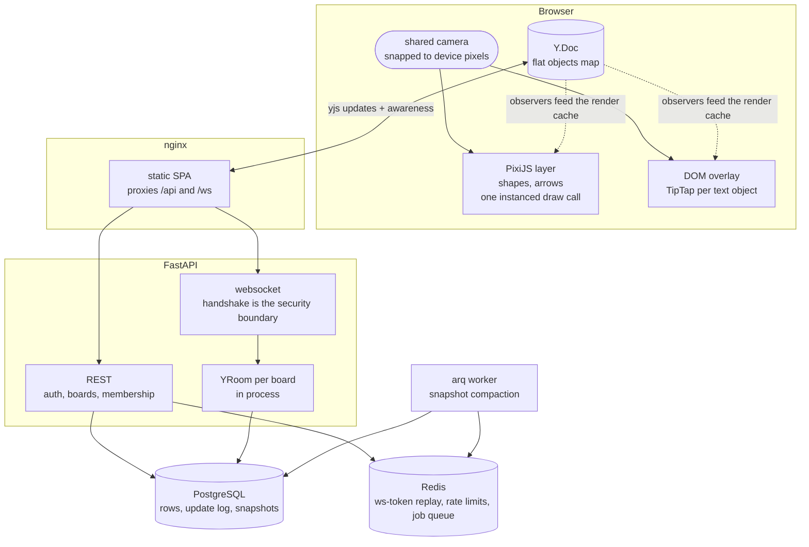

# Meadow

An infinite-canvas collaborative notes app: OneNote-style freeform editing combined
with FigJam-style whiteboarding. Text, shapes and arrows all live as objects on one
shared surface, and tables and charts join them in v2.

A board is called a **field**. Remote cursors are **wanderers**.

> **Status: M0 through M5 complete, M6 in progress.** The canvas, realtime editing,
> presence and the production infrastructure are built and exercised. It is not
> deployed yet. See [Build status](#build-status).

---

## The idea

**There is no page. There is only the canvas.** Everything a user creates is an object
at an (x, y) position on an infinite surface. A note is not a document, it is a text
object placed somewhere. That gives one object model, one selection system, one
transform system, one undo stack, and one CRDT document per board.

Rich text cannot be edited inside WebGL, so the canvas is two layers sharing a single
camera: a PixiJS/WebGL layer for shapes and arrows, and a DOM overlay for text. Both
read the same camera matrix and must never drift.



Everything a user creates is an object in one flat `Y.Doc` map. The engine never reads
through React: a tool writes to the document, and Y observers update the render cache,
so a local drag and a remote peer's edit take the same path.

Full design, schema, and milestone order: [`docs/core/ARCHITECTURE.md`](docs/core/ARCHITECTURE.md).
What each phase actually delivered, and what was thrown away getting there:
[`CHANGELOG.md`](CHANGELOG.md).

---

## Stack

| Layer | Choice |
|---|---|
| Frontend | React 19, TypeScript, Vite 6, PixiJS 8, TipTap 2, yjs, rbush, Zustand, Tailwind 4 |
| Realtime | yjs CRDT over websocket, y-indexeddb for offline, awareness for presence |
| Backend | FastAPI, pycrdt + pycrdt-websocket (Rust-backed yjs bindings), SQLAlchemy 2 async, Alembic, arq |
| Auth | argon2id, JWT access tokens, rotating refresh tokens with reuse detection |
| Data | PostgreSQL 16, Redis 7. MinIO is planned for v2 uploads and is not deployed |
| Infra | Docker Compose, nginx, GitHub Actions to GHCR to VPS |

Fonts: Inter for UI and default text objects, Comic Neue as a text-object option,
JetBrains Mono for code. Self-hosted woff2, no CDN.

---

## Build status

Milestones ship in order; a milestone does not start before the previous one works.

| Milestone | Scope | Status |
|---|---|---|
| M0 | Realtime spike: ws auth, CRDT convergence, Postgres persistence | Complete |
| M1 | Auth and boards CRUD, JWT with refresh rotation, permissions | Complete |
| M2 | Canvas core: camera, shapes, hit-testing, transforms, undo | Complete |
| M3 | Text objects: DOM overlay, TipTap per object, sticky notes | Complete |
| M4 | Arrows and bindings | Complete |
| M5 | Realtime polish: awareness, compaction job, thumbnails | Complete |
| M6 | Ship v1: images, production compose, proxy, CI | In progress |

What is left in M6 is the deployment itself, a demo recording, and choosing a licence.
The infrastructure is built and runs: `pnpm check:stack` brings the production compose
up and asserts against it.

M0 was a gate, not a feature. Its job was to answer one question before any canvas
code existed: does a Python CRDT backend actually carry this workload, or does the
project need Node and Hocuspocus? The answer is that Python carries it.

### What M0 proves

Run it yourself with `./scripts/m0-gate.sh`:

```
== phase: convergence
PASS  client A connected with a valid ws-token
PASS  client B converged on A's 3 objects (saw 3)
PASS  client A saw B's object (4 objects)

== restarting api (cold process, nothing retained in memory)

== phase: persistence across restart
PASS  state reloaded from Postgres after full server restart (4 objects)
PASS  object contents intact: diamond, ellipse, rect, sticky

== phase: offline edit and reconnect
PASS  offline edit applied locally while disconnected
PASS  offline edit reached a fresh client after reconnect (5 objects)

== phase: handshake rejection
PASS  replayed ws-token rejected with 4401 (got 4401)
PASS  invalid ws-token rejected with 4401 (got 4401)
PASS  missing ws-token rejected with 4401 (got 4401)
```

The harness drives real `yjs` clients over the wire, so this tests genuine
JavaScript-to-pycrdt wire compatibility rather than pycrdt talking to itself. The
restart phase kills the server process entirely and starts a cold one; reloading after
a mere client reconnect would prove nothing, since the document would still be in
server memory.

## What M1 adds

Users, workspaces, boards, membership, and the permission layer the handshake needs
to stop being a stub.

**The five rejection paths were written as failing tests before the implementation.**
That ordering is the point: tests written afterwards get shaped by the code and pass
without proving anything.

| The socket must refuse | Close code |
|---|---|
| Valid token, real board, caller has no membership | 4403 |
| Token minted for board A, presented to board B | 4403 |
| Board deleted between mint and connect | 4403 |
| Access token expires mid-session | 4401, watchdog closes the live socket |
| Unknown board id (never distinguished from "no access") | 4403 |

Plus the viewer story, both halves together: the server drops a viewer's document
writes, and the client is told its role at mint time so it disables the tools and
refuses the write in `doc/mutations.ts`. Server-side dropping alone is not enough —
a viewer's own `Y.Doc` still applies their edits locally, so they would watch them
appear, survive a refresh via IndexedDB, and then vanish. That is the first bug report
a demo user files.

Also in M1: argon2id passwords, refresh-token rotation with reuse detection, citext
emails, Redis rate limits, Alembic owning the schema, and a React app with
login/register and a board list.

## What M2 to M5 add

The canvas, and everything that has to be true for two people to use it at once.

**M2 — the engine.** Camera, viewport culling through an R-tree, hit-testing,
selection and transforms, undo. Primitives render through an instanced signed-distance
batch, which issues one draw call for the whole scene rather than one per object.

**M3 — text.** Rich text cannot be edited inside WebGL, so text objects live in a DOM
overlay driven by the same camera as the canvas, with a TipTap editor bound to a
`Y.XmlFragment` per object. The two layers must not drift apart by so much as a pixel
at any zoom, which is measured against screenshots rather than arithmetic.

**M4 — arrows.** A separate `Graphics` pass above the shape batch, rebuilt each frame,
with endpoints bound to shapes and resolved analytically against the real outline.
Binding reflow happens inside the same `Y.transact` as the move that caused it, so a
peer never observes a shape in its new position with the arrow still on the old one.

**M5 — presence and upkeep.** Wanderers and selection highlights over awareness, which
never touches the Y.Doc; snapshot compaction on an arq cron; board thumbnails.

## What M6 adds

The infrastructure to run it: an API image with three entrypoints, an nginx image with
the SPA baked in, a production compose file with a migration gate, CI, and a
development profile that runs the whole app in docker with hot reload.

The piece worth reading the config for is the forwarded-header handling. `--proxy-headers`
without a trust list is not a flag, it is a vulnerability: X-Forwarded-For is
client-supplied, so anyone could choose their own rate-limit bucket and their own
audit-log address. nginx uses `real_ip_recursive off` for the same reason, which is the
counter-intuitive setting and the correct one. `pnpm check:stack` proves it by
registering six times behind six forged addresses and requiring the API to refuse.

```bash
cd services/api && .venv/bin/python -m pytest    # 58 tests
pnpm check:stack                                 # 15 assertions against the real stack
```

---

## Running it

Requires Docker, Node 22+, pnpm, Python 3.13, and uv.

```bash
cp .env.example .env          # ports and credentials live here

# postgres, redis, pgadmin. The -f is not optional: docker-compose.yml is the
# production stack, and a bare `docker compose up -d` here starts that instead.
docker compose -f docker-compose.local.yml up -d

cd services/api
uv venv --python 3.13
uv pip install -e . --group dev
.venv/bin/alembic upgrade head    # Alembic owns the schema from M1
cd ../..

pnpm install
```

Then two terminals:

```bash
# API
cd services/api && .venv/bin/python -m uvicorn app.main:app --port 8012

# web
pnpm --filter web dev
```

### Or run everything in Docker, with hot reload

One command, no host Python and no host Node:

```bash
docker compose -f docker-compose.local.yml --profile app up
```

That adds `api`, `worker`, `web` and a one-shot `migrate` alongside postgres and redis,
with your working tree bind-mounted into them. Edits reload in place: uvicorn restarts
the API on a Python change, vite hot-reloads the browser on a TypeScript one, and
watchfiles restarts the arq worker. Nothing needs a rebuild until a dependency changes.

The containers sit behind a `--profile app` flag rather than starting by default,
because they take the same two ports the M0 gate and the e2e scripts need for the
servers they spawn themselves. A plain `up -d` still brings up infrastructure only.

Two things are worth knowing about how it is wired, because getting either wrong
produces a confusing failure:

- **`node_modules` is the image's, never the host's.** The bind mount covers
  `apps/web`, and two anonymous volumes sit on top of the `node_modules` directories to
  keep the container's copy. The host tree is installed for the host platform, and
  pnpm's symlinked layout does not survive being half-overlaid; the symptom reads like
  a vite bug rather than a mount problem.
- **File watching may need polling.** Bind mounts on WSL and on docker-for-mac often do
  not deliver inotify events into the container. If an edit does not trigger a reload,
  set `MEADOW_WATCH_POLL=true` in `.env`. It is off by default because on a native
  filesystem it is wasted CPU forever.

Run the checks inside the containers too, if you would rather not install the
toolchains:

```bash
docker compose -f docker-compose.local.yml --profile app exec api pytest -q
docker compose -f docker-compose.local.yml --profile app exec api ruff check .
docker compose -f docker-compose.local.yml --profile app exec web pnpm --filter web test
```

| Service | URL |
|---|---|
| Web app | http://localhost:3012 |
| API | http://localhost:8012 |
| API docs | http://localhost:8012/docs |
| pgAdmin | http://localhost:5051 |
| Postgres | localhost:5435 (`meadow`, and `meadow_test` for the suite) |
| Redis | localhost:6380 (db 0 dev, db 1 tests) |

Ports are read from `.env` by `docker-compose.local.yml`, the API (via
pydantic-settings), and Vite alike, so there is one place to change them. Postgres sits on 5435 and Redis on
6380 to avoid colliding with native instances commonly already running on the
default ports.

Register an account, create a field, and open it. To see convergence, open the same
field in two browsers (two tabs of the same browser also work, but they sync through a
BroadcastChannel as well as the server, so a tab pair cannot tell you whether the
server is doing its job). To see persistence, stop the API, restart it, and reload.

### Tests and checks

```bash
cd services/api
.venv/bin/python -m pytest                 # 58 tests, against real Postgres and Redis
.venv/bin/ruff check . && .venv/bin/mypy app/
.venv/bin/alembic check                    # fails if the models drifted from migrations

pnpm --filter web lint                     # tsc
pnpm --filter web test                     # vitest

./scripts/m0-gate.sh                       # end-to-end, restarts the server mid-run
pnpm smoke:canvas                          # engine against a local Y.Doc
pnpm smoke:overlay                         # overlay drift, measured on pixels
pnpm e2e:board                             # auth -> draw -> type -> reload
pnpm e2e:presence                          # two real browsers on one board
pnpm check:stack                           # the production stack, through nginx

pnpm hooks:run                             # the pre-commit hook, on what is staged now
```

A pre-commit hook runs the fast half of that list on every commit, chosen by what is
staged: repo rules always, `tsc` and vitest when `apps/web` or `packages/schema` is
involved, ruff and mypy when `services/api` is. It lives in `.githooks/`, which
`pnpm install` points git at through `core.hooksPath`, so it is versioned with the
repo rather than copied into each clone by hand. Nothing in it needs a container, a
database or a browser: a check you cannot run because Postgres is down is a check
people learn to skip.

The repo rules are the non-negotiables from `.claude/CLAUDE.md` that no linter knows
about, read off the added lines only. `src/canvas/` importing from `src/features/`, a
`Y.transact` outside `src/doc/`, a second `resolve_role`, an `any`, a staged `.env`.
Style preferences print as notes and never block, because a hook that blocks on a
judgement call teaches people to pass `--no-verify`, and after that the real checks
stop running too.

The suites are split by what they can actually prove. Unit tests and the vitest suite
run against a local `Y.Doc`. The pytest suite runs against a real Postgres and a real
Redis, because the things it has to get right - citext, native enums, advisory locks,
`SET NX` replay protection - are exactly what an in-memory substitute papers over. The
e2e scripts drive real browsers. And `check:stack` drives the deployed artefact,
because everything above it talks to a uvicorn on the host and would pass against a
proxy config that drops the websocket upgrade.

The test suite creates and migrates a `meadow_test` database and uses Redis db 1, so
it never touches dev data. The M0 gate stays scoped to the foundation over a real
socket with the real `y-websocket` client; M1's permission assertions live in pytest,
which can set up ten users far more cheaply.

---

## Deploying

`docker-compose.yml` is the production stack and `docker-compose.local.yml` is the
development one, which is the reverse of the usual arrangement. The file that runs
unattended on a server is the one that should not need a flag to select.

```bash
cp .env.prod.example .env.prod     # fill in the passwords and the JWT secret
docker compose --env-file .env.prod up -d --wait
node scripts/stack-check.mjs       # WEB_PUBLIC_PORT is read from the environment
```

That brings up postgres, redis, a one-shot migration, the API, the arq worker, nginx
with the SPA baked in, and a backup sidecar. Postgres and Redis publish no host ports.
The API waits on the migration completing successfully, so a failed migration stops the
deploy rather than producing a running API that 500s on its first query.

**TLS is not in the compose file.** The stack serves plain HTTP on one port bound to
loopback and expects the host's edge proxy to terminate. Certificates are host state
with a renewal timer, and the container reads the original scheme from
X-Forwarded-Proto, so the refresh cookie is still marked Secure behind a terminator.

If you do put a proxy in front, set `MEADOW_TRUSTED_PROXY_CIDR` to the docker bridge
gateway. Left at its default nothing arriving over the bridge matches it, so
X-Forwarded-For is ignored and every visitor shares the terminator's address: one
rate-limit bucket and one audit-log entry for the whole internet. The default is the
safe direction of that trade, not the useful one.

**Backups are local only.** The sidecar dumps nightly, verifies each dump with
`pg_restore --list` before it counts, and keeps seven days. It dumps once at startup so
the first deploy proves backups work rather than finding out a day later. There is no
offsite push: the dumps sit on the same disk as the database they protect, which covers
a bad migration and does not cover a lost VPS.

CI runs lint, both test suites, the e2e scripts, and the stack check on every push.
`release.yml` publishes three images to GHCR and deploys over ssh, gated on ci passing
and on a `production` environment so the VPS credentials are not readable by every
workflow in the repo.

---

## Layout

```
apps/web/
  src/canvas/          engine: camera, renderers, overlay, hit-testing, tools
  src/doc/             CRDT schema, mutations (every Y.Doc write), useObjects
  src/sync/            provider setup, reconnection, token minting, awareness
  src/features/        auth, boards list, board view
  src/lib/api.ts       REST client, access token in memory only
packages/schema/       ObjectData snapshots, arrow geometry and binding maths
services/api/
  app/api/v1/          REST routers
  app/auth/            password hashing, JWT, refresh rotation, dependencies
  app/realtime/        ws endpoint, room manager, Postgres YStore, ws-tokens, guard
  app/services/        permissions.py (the single authority), rate limiting
  app/workers/         arq worker: compaction cron
  alembic/             migrations
  tests/               handshake, auth, permissions, persistence, concurrency
docs/core/             ARCHITECTURE.md, the source of truth
scripts/               gate harness, smokes, e2e, benchmarks, stack check
.githooks/             pre-commit, wired up by scripts/install-hooks.mjs
docker/
  api/                 API image: web process, worker, and migrator
  web/                 SPA build baked into nginx
  nginx/               base conf and the site template
  backup/              pg_dump sidecar
  pgadmin/             dev console config
```

`apps/web/src/canvas/` must never import from `src/features/`. The engine stays
independent and extractable.

---

## Measured, and not

Numbers taken under software rasterisation are not the numbers the target is about, so
they are reported separately rather than rounded into the good column.

| | |
|---|---|
| Draw calls at 5,000 objects | **1**, measured |
| CPU frame cost at 5,000 objects | **3.5ms median**, `pnpm bench:canvas` |
| Overlay drift, zoom 0.33 to 2.5, dpr 1 and 2 | **within 1 CSS pixel**, measured against screenshots by `pnpm smoke:overlay` |
| Arrow pass, per arrow | **10.9 µs**, `pnpm bench:arrows`. 2.2ms at 200 arrows |
| 60fps at 5,000 objects | **not verified.** Every run so far rasterised in software, where `app.render()` returns before rasterisation finishes, so it measures CPU work only. Needs real hardware |
| 20,000 objects | **never measured.** The dev machine OOM-kills the run at that size |
| Concurrent editors, cursor latency, compaction throughput | **not measured.** Correctness is covered by the suites; the numbers are not |

The overlay figure is the one worth explaining. It is measured by sampling pixels out
of screenshots rather than by comparing the two transforms in code, because the failure
mode being tested *is* the browser and the GPU rounding the same arithmetic
differently. A test that computes both sides itself agrees with itself and proves
nothing.

---

## Decisions worth knowing

These are the ones that are expensive to reverse, so they were settled before any code
was written.

**CRDTs, not OT.** Operational transformation is the older and, on paper, the more
efficient answer: it sends compact operations and keeps no per-character metadata. It
also requires a central server that serialises every operation and transforms each one
against everything it missed, and the transformation functions have to be correct for
every pair of operation types. That is a well-known source of subtle, data-losing bugs,
and adding an operation type means revisiting every pair.

Three things about this project make the trade go the other way. It has to work
offline, and an OT client that has been disconnected for an hour has to be transformed
back in against an hour of history, while a CRDT just merges. It has two very different
data shapes, a flat map of object properties and rich text inside those objects, and
yjs covers both with the same merge rules rather than two transformation matrices. And
it is a solo project, where "the library is responsible for convergence" is worth
paying real bytes for.

The cost is real and shows up in two places. Deleted content leaves tombstones, which
is why snapshot compaction exists at all. And concurrent edits converge to *a*
consistent answer rather than the one a human would have picked: last-writer-wins on a
contended field, and an undo that can resurrect an object a peer deleted. Both are
pinned by tests rather than hoped about, in `services/api/tests/test_concurrency.py`
and `apps/web/src/doc/convergence.test.ts`.

**A flat `objects` map with `parentId` pointers, not a nested tree.** Nested `Y.Map`
trees make reparenting (dragging a shape into a frame) a delete-and-recreate, which
loses concurrent edits. A flat map makes it a single field write.

**`Y.XmlFragment` for text, not a string field.** It is what `y-prosemirror` binds to.
Two users typing in the same text object merge character by character; a plain string
would last-write-wins and drop keystrokes.

**The websocket handshake is the security boundary.** Validate the token, resolve the
board role, and reject before joining the room. REST permission checks are decorative
if this is wrong, which is why its rejection paths were the first tests written.

**Compaction never derives its read set from a watermark.** Postgres sequences are
non-transactional, so a row holding `id=98` can commit after one holding `id=99`. A
compaction that folds everything `<= max(id)` and records that as a high-water mark
strands the late row permanently, and a room load filtering on it never sees the row
again. Instead, compaction deletes exactly the rows it folded and room load reads
every surviving row with no id filter. `up_to_update_id` is kept as a diagnostic
column only. Yjs updates are commutative and idempotent, so a duplicate re-apply is
harmless while a lost update is not.

**One draw call for every primitive, via a signed distance field.** A `Container` plus
`Graphics` per object is the structure everyone reaches for, and it issues a draw call
per object. The measured table is above. The SDF approach also solves a problem the
alternatives cannot: a texture atlas or scaled geometry distorts stroke width and
corner radius as the shape grows, while an SDF evaluated in world units keeps both
exact at any size and any zoom.

**Document state never lives in React.** The engine keeps a cache built from Y
observers, and a tool's write goes to the Y.Doc first, with the observer feeding the
cache afterwards. A local drag takes exactly the same path as a remote peer's edit, so
there is no second code path to keep correct. React re-renders the chrome, never the
canvas.

**Single-use ws-tokens require driving reconnection manually.** `y-websocket` composes
its URL once and retries on its own schedule, so its built-in reconnect would replay a
spent token forever. `apps/web/src/sync/provider.ts` disables autoconnect and mints a
fresh token per attempt with capped backoff.

**Tokens carry identity, never authorisation.** The access token does not contain
`workspace_ids` and the ws-token does not contain a role, both departures from the
original spec. Memberships in a bearer token are authorisation data that is stale by
design: a user removed from a workspace would keep access until their token expired.
Roles are resolved live from the database on every request and at every connect, by
one function — `app/services/permissions.py`. The ws-token does carry its parent
access token's expiry, so a connection can never outlive the session that authorised
it.

**Compaction takes a Postgres advisory lock, not a Redis one.** `pg_advisory_xact_lock`
releases on commit or rollback, so a worker killed mid-run cannot strand a board behind
a TTL, and the lock lives in the same transaction as the work it guards — a separate
Redis TTL can lapse while the compaction transaction is still open. The key uses the
two-int form with a namespace constant rather than truncating the board uuid into the
single-bigint form; collisions only cost two unrelated boards serialising against each
other, but they are near-undiagnosable after the fact.

### Known sharp edges

- Local undo can resurrect an object that a remote user deleted. This is inherent to
  `Y.UndoManager` and Figma behaves the same way. Accepted and documented rather than
  worked around.
- `pycrdt-websocket` 0.16 dropped the server-level `ystore` argument; persistence is
  per-room, so `MeadowWebsocketServer.get_room` attaches the store and loads state
  before the room starts.
- PixiJS 8 supplies its global and mesh-local uniforms as individual uniforms, not as
  interface blocks, and it looks up a location for every uniform it declares. A custom
  shader must therefore declare them plainly and reference all of them, since the GLSL
  compiler strips unused ones and Pixi then reads a location off `undefined`.
- Pixi derives a container's bounds from its geometry. An instanced batch is one unit
  quad no matter how many objects it draws, so `ShapeBatch` sets `boundsArea`
  explicitly. Without it the batch reports itself as 1x1 and anything reading bounds,
  including `renderer.extract`, silently sees almost nothing.
- **`YRoom.stop()` cancels in-flight store writes.** It cancels the task group that
  `ystore.write` was spawned on, without waiting — and with `auto_clean_rooms` on, the
  last client leaving stops the room. So an update that arrived moments earlier races
  its own persistence and loses: type, close the tab, edit gone. `PostgresYStore.write`
  shields its transaction from cancellation. This survived M0 only because real clients
  stayed connected long enough for the write to win the race.
- **`WebsocketServer.delete_room` is not idempotent**, and `serve` calls it whenever
  the client it was serving was the last one out. Two clients disconnecting together
  both observe an empty client set, and the second raises `ValueError` out of the
  teardown path of an ordinary disconnect. `MeadowWebsocketServer` overrides it.
- Two tabs of the same browser sync through a `BroadcastChannel` as well as the
  server, so a tab pair cannot verify server behaviour. Use two browsers, or
  `disableBc: true`.
- **The API runs one uvicorn worker, and that is a ceiling rather than a default.**
  Rooms are in-process state, so two workers would each hold their own `YRoom` for the
  same board and the halves would see each other only through the Postgres update log.
  Going past one process needs a Redis-backed room registry, which is v2.
- **Backups are on the same disk as the database.** Nightly, verified, seven days
  retained, and no offsite copy. That covers a bad migration and does not cover losing
  the VPS.
- The backup sidecar is built from `postgres:16-alpine` rather than the third-party
  image the architecture doc named, which does not execute at all on the development
  machine: every binary in it, down to `/bin/sh`, exits with "exec format error", while
  other images on the same daemon are fine.

---

## License

Not yet chosen, which means the default applies: no permission is granted to use,
copy, or modify this code. That is not the intent, and it is the last open item in M6
alongside the deploy itself.
